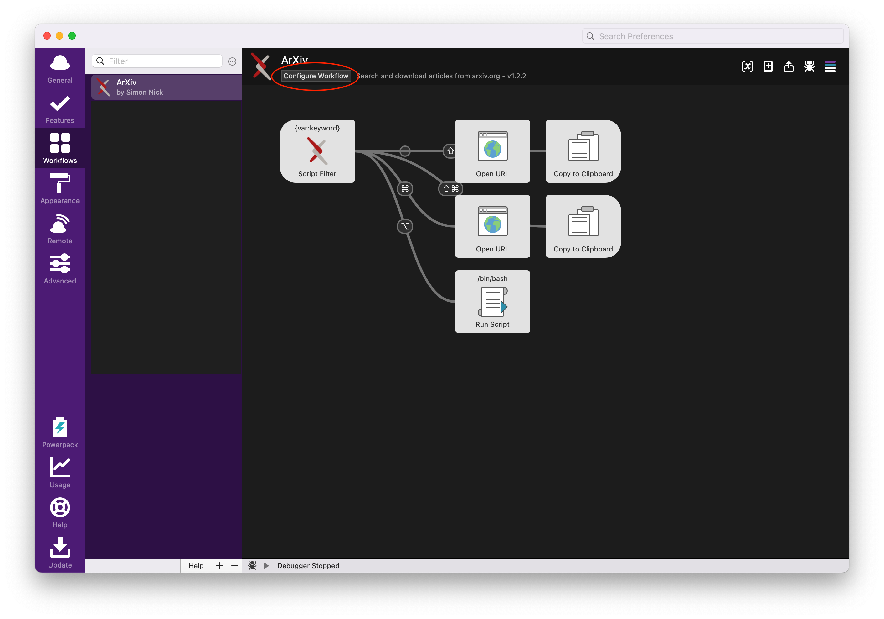
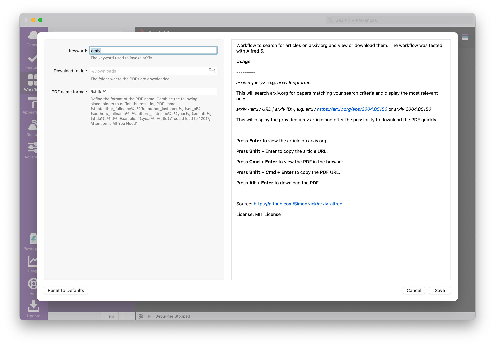

# Alfred arXiv workflow

[Alfred](https://www.alfredapp.com/) workflow to search for articles on arXiv.org and view or download them. The workflow was tested with Alfred 5.


## Table of Contents

- [Table of Contents](#table-of-contents)
- [Download](#download)
- [Installation](#installation)
  - [Permissions](#permissions)
  - [Why is this needed?](#why-is-this-needed)
- [Usage](#usage)
- [Change Default Settings](#change-default-settings)
- [Development](#development)
- [Maintainers](#maintainers)
- [License](#license)

## Download

Click [here](https://github.com/SimonNick/arxiv-alfred/releases/download/v1.2.0/arXiv.alfredworkflow) and download `arXiv.alfredworkflow`.

## Installation

Open the `arXiv.alfredworkflow` file and Alfred will install the workflow automatically.

### Permissions

Since [MacOS Catalina](https://developer.apple.com/news/?id=10032019a), you need to grant permission to execute the included binaries. For that, first open the workflow folder by right-clicking on ArXiv in the workflow settings and selecting `Open in Finder`. Next, right click on the `arxiv_*` and `download_*` binary for your platform (Intel Macs `arxiv_amd64` resp. `download_amd64`, Apple Silicon Macs `arxiv_arm64` resp. `download_arm64`) and select `Open` in the pop up. This will open a Terminal window and you should see an error message. However, you have now permitted MacOS to run the binaries.

### Why is this needed?

Since [MacOS Catalina](https://developer.apple.com/news/?id=10032019a) Apple does not allow running arbitrary binaries unless they are notarized. Developers can notarize their binaries if they enroll for the Apple Developer Program which is around $100 per year. Since I am not enrolled, I can't notarize the binaries and we unfortunately need to resort to the above procedure.

## Usage

`arxiv <query>`, e.g. `arxiv longformer`

This will search arxiv.org for papers matching your search criteria and display the most relevant ones.

`arxiv <arxiv URL | arxiv ID>`, e.g. `arxiv https://arxiv.org/abs/2004.05150` or `arxiv 2004.05150`

This will display the provided arxiv article and offer the possibility to download the PDF quickly.

Press **Enter** to view the article on arxiv.org.

Press **Shift + Enter** to copy the article URL.

Press **Cmd + Enter** to view the PDF in the browser.

Press **Shift + Cmd + Enter** to copy the PDF URL.

Press **Alt + Enter** to download the PDF.

## Change Default Settings

By default, ArXiv uses `arxiv` as keyword, downloads the PDFs to the Downloads folder and uses the article title as PDF name. You can change these default settings in Alfred's preferences. For this, go to Workflows, select ArXiv and click on the `Configure workflow` button in the top bar.



You can now see three text fields that allow you to change the
- keyword
- download folder
- PDF name format



The PDF name is automatically generated using a user-provided template string. You can use the following placeholders in the template string:
- `%firstauthor_fullname%`: The full name of the first author
- `%firstauthor_lastname%`: The last name of the first author
- `%et_al%`: If there is more than one author, this will result in `et al`
- `%authors_fullname%`: The comma-separated full names of all authors
- `%authors_lastname%`: The comma-separated last names of all authors
- `%year%`: The publication year
- `%month%`: The publication month
- `%title%`: The title of the article
- `%id%`: The article ID

Example: `%year%, %title%` could result in `2017, Attention Is All You Need`

## Development

Run the `compile.sh` script:

```shell
sh compile.sh
```

Then move all four compiled binaries under `download` and `workflow` to the Alfred workflow folder.

## Maintainers

[@SimonNick](https://github.com/SimonNick)

## License

[MIT License](LICENSE) © Simon Nick
